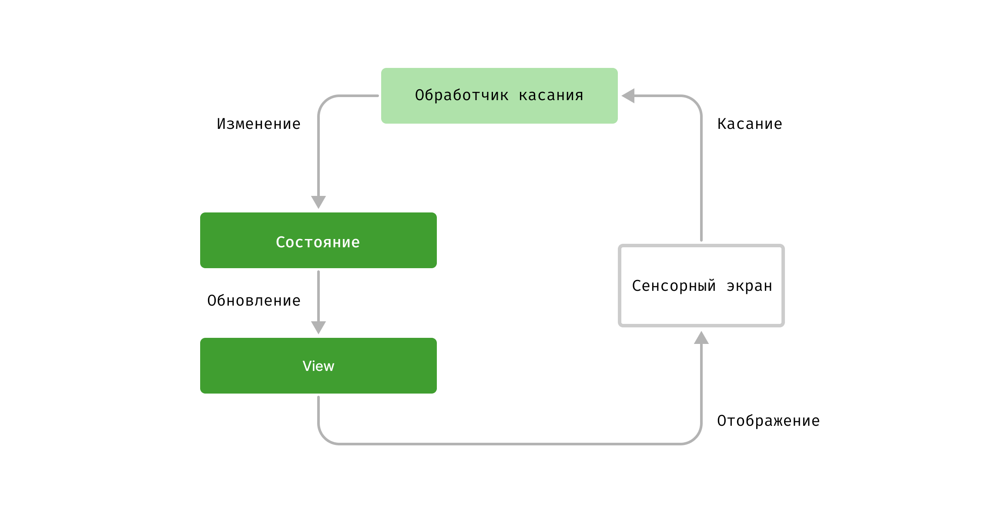
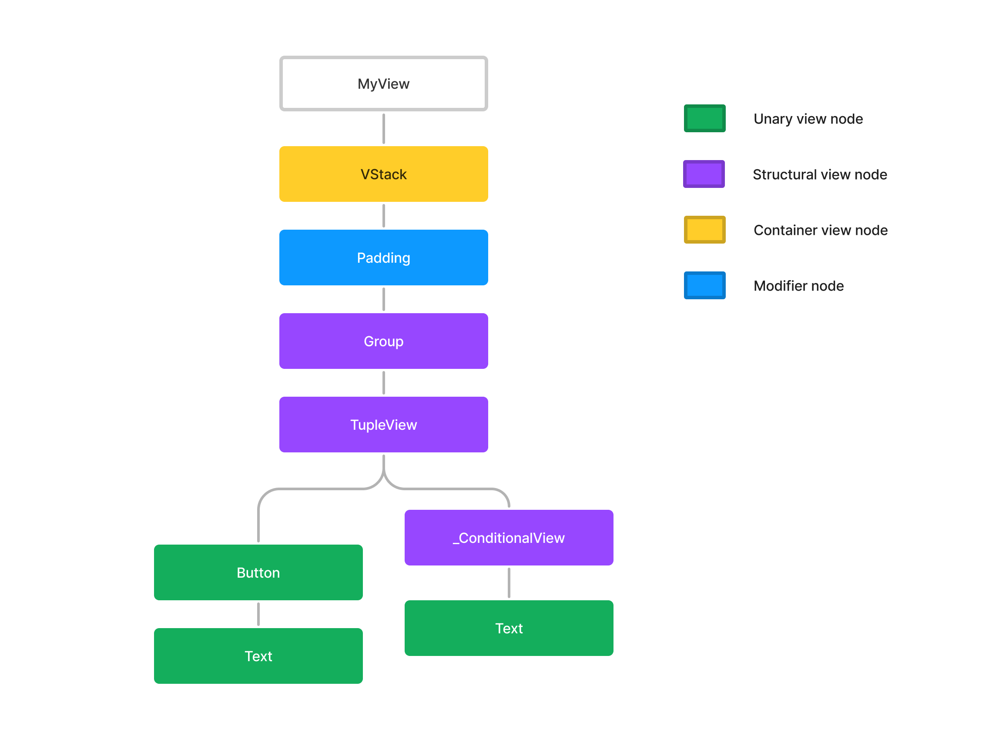
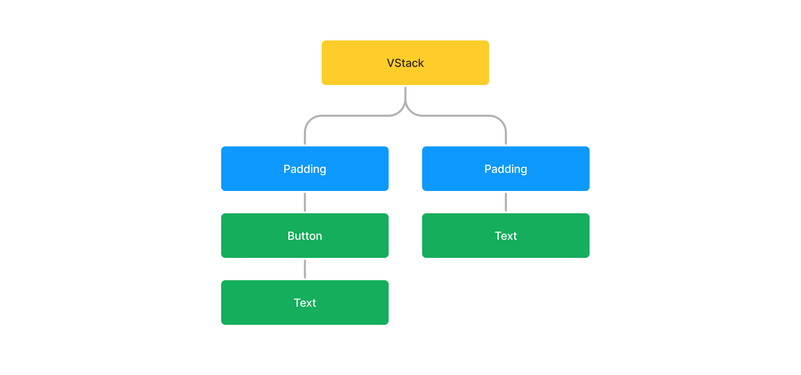

https://rensbr.eu/blog/swiftui-diffing/

# Алгоритм сравнения в SwiftUI

Если есть одна вещь, отличающая [SwiftUI](https://developer.apple.com/documentation/swiftui) от других похожих декларативных фреймворков пользовательского интерфейса, таких как React, то это использование системы статических типов. Тип [`View`](https://developer.apple.com/documentation/swiftui/view) делает сравнение элементов иерархии интерфейса быстрым и однозначным. Но как именно это сравнение - диффинг (анг. diffing) - работает? И как именно работает сравнение экземпляров представлений в [SwiftUI](https://developer.apple.com/documentation/swiftui)?

Недавно я запустил [SwiftTUI](https://github.com/rensbreur/SwiftTUI) - клон [SwiftUI](https://developer.apple.com/documentation/swiftui) для текстовых терминальных приложений. Для его реализации мне нужно было точно выяснить, как происходит диффинг в [SwiftUI](https://developer.apple.com/documentation/swiftui). В этой статье я представляю вам свои выводы.

## Диффинг и декларативный UI

Декларативные фреймворки пользовательского интерфейса и дифферинг идут рука об руку. При декларативном программировании пользовательского интерфейса вместо непосредственного изменения элементов пользовательского интерфейса, отображаемых на экране, вы изменяете некоторое состояние приложения. На основе нового состояния декларативный фреймворк должен будет вычислить, как это изменение повлияет на видимый пользователю UI.



Фреймоворк не может заменить все старые элементы интерфейса на новые после каждого изменения состояния приложения из-за сложной иерархичной структуры UI: многие элементы имеют свои дочерние элементы, которые также имеют своё состояние и так далее. Фрейморку необходимо знать, был ли удалён или вставлен дочерний элемент, чтобы увидеть в итоге, нужно ли нам оставить текущее состояние или создать новое элемента более высокого уровня.

Фреймворку также необходимо знать, какие именно элементы интерфейса добавляются или удаляются, чтобы обновить (или не обновлять) элемент-контейнер, в котором они находятся. Например, стэки могут менять вёрстку своих дочерних элементы, если их содержимое изменилось, а список будет реагировать на изменения только при вставке или удалении элемента, и если только изменяемые элементы находятся в его видимой области. В дополнение ко всему, если любое изменение иерархии можно вычислить, то его же можно попутно анимировать.

## Диффинг

Основная проблема вычислений различий заключается даже не в их производительности, но в том, что сами различия могут быть неоднозначными.

Возьмём для примера список с двумя лейблами:

    → List
      → Label("Один")
      → Label("Два")
  
Пусть он изменится на следующий список:
 
    → List
      → Label("Два")
      → Label("Три")
   
Что здесь изменилось? Возможно, метка с надписью "Один" была удалена из начала списка, а метка с надписью "Три" была добавлена в конце. Или, может быть, текст первого лейбла был изменен с "Один" на "Два", а второй - с "Два" на "Три". На самом деле и то, и другое может быть правдой!

Фреймворк может отдавать предпочтение одному типу изменений перед другим. Или он может потребовать, чтобы элементы пользовательского интерфейса имели идентификаторы, чтобы он мог их различить. React оставляет этот выбор за программистом.

Если у вас есть список элементов интерфейса с идентификаторами, вам потребуется алгоритм кратчайшего сценария редактирования (shortest-edit-script), такой как [алгоритм Майерса](https://habr.com/ru/companies/redmadrobot/articles/460673/), который может найти наименьший набор вставок и удалений для перехода от одной последовательности к другой.

Для большинства изменений [SwiftUI](https://developer.apple.com/documentation/swiftui) не нужен такой алгоритм. Ему также не нужны идентификаторы для представлений, чтобы исключить двусмысленность. Фреймворк полагается исключительно на статическую типизацию `View`.

## Один или несколько View

Официальная документация к [`View`](https://developer.apple.com/documentation/swiftui/view) в [SwiftUI](https://developer.apple.com/documentation/swiftui) гласит:

Это тип, который отвечает за представление элемента интерфейса вашего приложения и предоставляет модификаторы для конфигурации этого элемента.

Это описание слегка вводит в заблуждение, так оно имеет смысл для таких типов [`View`](https://developer.apple.com/documentation/swiftui/view), как [`Text`](https://developer.apple.com/documentation/swiftui/text), [`Color`](https://developer.apple.com/documentation/swiftui/color/) или, например, фигуры (протокол [`Shape`](https://developer.apple.com/documentation/swiftui/shape)). Но другие элементы, например такие как [`ForEach`](https://developer.apple.com/documentation/swiftui/foreach), являются композициями из других элементов. Такие элементы по-прежнему являются [`View`](https://developer.apple.com/documentation/swiftui/view), но они репрезентуют сразу несколько элементов пользовательского интерфейса приложения.

Особенно странным в таком случае является [`EmptyView`](https://developer.apple.com/documentation/swiftui/emptyview/). [`EmptyView`](https://developer.apple.com/documentation/swiftui/emptyview/) - это такое представление, которое не представляет никакого элемента пользовательского интерфейса. Если вы поместите в список один лишь [`EmptyView`](https://developer.apple.com/documentation/swiftui/emptyview/), то в списке не будет вообще никаких ячеек.

Другие интересные [`View`](https://developer.apple.com/documentation/swiftui/view) - те, которые создаются с помощью конструкторов представлений [`ViewBuilder`](https://developer.apple.com/documentation/swiftui/viewbuilder/). Конструкторы представлений могут иметь внутри себя if-statements ветвления, и поэтому элементы, построенные с их помощью, могут быть непостоянными динамическими наборами из других элементов интерфейса, таких как [`ForEach`](https://developer.apple.com/documentation/swiftui/foreach).

## Составные и примитивные View

В коде, [`View`](https://developer.apple.com/documentation/swiftui/view) определяется протоколом, для которого единственное требование — это наличие body, который также является [`View`](https://developer.apple.com/documentation/swiftui/view).

```swift
protocol [`View`](https://developer.apple.com/documentation/swiftui/view) {
    associatedtype Body: View
    var body: Body { get }
}
```

Это не может продолжаться вечно: должны быть [`View`](https://developer.apple.com/documentation/swiftui/view), которые не определяются через другие [`View`](https://developer.apple.com/documentation/swiftui/view). Я назову такие [`View`](https://developer.apple.com/documentation/swiftui/view) *Примитивными*. Обычные [`View`](https://developer.apple.com/documentation/swiftui/view), построенные из других [`View`](https://developer.apple.com/documentation/swiftui/view), назову *Составными*. Примитивные [`View`](https://developer.apple.com/documentation/swiftui/view) имеют тип `body` –[`Never`](https://developer.apple.com/documentation/swift/never/) и вызов у них `body` приведет к сбою. Такие [`View`](https://developer.apple.com/documentation/swiftui/view) построены на логике, скрытой из публичного интерфейса [SwiftUI](https://developer.apple.com/documentation/swiftui).

Как пользователи фреймворка [SwiftUI](https://developer.apple.com/documentation/swiftui), мы можем создавать только составные [`View`](https://developer.apple.com/documentation/swiftui/view). Составные [`View`](https://developer.apple.com/documentation/swiftui/view) могут иметь состояние и могут рассматриваться как функция этого состояния, преобразующая его в другое [`View`](https://developer.apple.com/documentation/swiftui/view). Составные [`View`](https://developer.apple.com/documentation/swiftui/view) используют примитивные [`View`](https://developer.apple.com/documentation/swiftui/view) в своем body. Примитивные [`View`](https://developer.apple.com/documentation/swiftui/view) являются строительными блоками для любых типов [`View`](https://developer.apple.com/documentation/swiftui/view).

Процесс сравнения обычно начинается с составного [`View`](https://developer.apple.com/documentation/swiftui/view), когда его `body` нужно переоценить в ответ на изменение состояния. [SwiftUI](https://developer.apple.com/documentation/swiftui) затем имеет старое и новое `body`, состоящие из какой-то комбинации примитивных и составных [`View`](https://developer.apple.com/documentation/swiftui/view). Необходимо провести их сравнение и отреагировать на изменения. Тип старого и нового `body` всегда одинаков.

Процесс сравнения также обычно заканчивается составными [`View`](https://developer.apple.com/documentation/swiftui/view), что является оптимизацией производительности в [SwiftUI](https://developer.apple.com/documentation/swiftui). Если `body` недействительного [`View`](https://developer.apple.com/documentation/swiftui/view) содержит другое составное [`View`](https://developer.apple.com/documentation/swiftui/view), свойства которого не изменились, то алгоритму не нужно дальше оценивать `body` этого [`View`](https://developer.apple.com/documentation/swiftui/view), и работа завершена.

Таким образом, [SwiftUI](https://developer.apple.com/documentation/swiftui) в основном сравнивает оставшиеся примитивные [`View`](https://developer.apple.com/documentation/swiftui/view), чтобы выяснить, что изменилось, делая их самыми важными в алгоритме сравнения. Составные [`View`](https://developer.apple.com/documentation/swiftui/view) запускают процесс сравнения и предоставляют новые `body`, которые нужно сравнить. Они также могут остановить дальнейшие вычисления. Но примитивные [`View`](https://developer.apple.com/documentation/swiftui/view) всё равно нужно сравнить, чтобы выяснить, какие изменения произошли.

## Категории примитивных View

Тот факт, что [`View`](https://developer.apple.com/documentation/swiftui/view) представляет собой ряд элементов пользовательского интерфейса, не обязательно означает, что все эти элементы будут присутствовать на экране, когда отображается этот [`View`](https://developer.apple.com/documentation/swiftui/view). Ленивые представления ([lazy views](https://developer.apple.com/documentation/swiftui/grouping-data-with-lazy-stack-views)), такие как [`List`](https://developer.apple.com/documentation/swiftui/list/), подгружают новые элементы пользовательского интерфейса из вложенных [`View`](https://developer.apple.com/documentation/swiftui/view) только в случае, если они находятся или будут находиться в видимой области скролла. Элементы пользовательского интерфейса, которые может сгенерировать [`View`](https://developer.apple.com/documentation/swiftui/view), мы можем называть `displayables`. [`View`](https://developer.apple.com/documentation/swiftui/view) в [`SwiftUI`](https://developer.apple.com/documentation/swiftui)  может иметь ноль или более `displayables`.

Когда речь идет о вычислении разницы между новым и старым `body`, мы можем разделить примитивные [`View`](https://developer.apple.com/documentation/swiftui/view), на четыре базовые категории:

1. **`Unary views`** — **`Унарные представления`**: [`View`](https://developer.apple.com/documentation/swiftui/view) с одним `displayable`, на практике это
    - `shapes` — различные формы и фигуры
    - `colors` — цвета и заливки,
    - `controls` — элементы управления: кнопки, переключатели, слайдеры и другие
    - `labels` — разные виды текста
2. **`Structural views`** — **`Структурные представления`**: [`View`](https://developer.apple.com/documentation/swiftui/view), которые принимают ноль или более других [`View`](https://developer.apple.com/documentation/swiftui/view) и создают одно новое [`View`](https://developer.apple.com/documentation/swiftui/view) из комбинации их `displayables`, причем необязательно из всех сразу. Примеры: [`ForEach`](https://developer.apple.com/documentation/swiftui/foreach), [`EmptyView`](https://developer.apple.com/documentation/swiftui/emptyview/) и [`View`](https://developer.apple.com/documentation/swiftui/view), используемые во [`ViewBuilder`](https://developer.apple.com/documentation/swiftui/viewbuilder/), таких как [`TupleView`](https://developer.apple.com/documentation/swiftui/tupleview/) и [`_ConditionalView`](https://www.hackingwithswift.com/books/ios-swiftui/conditional-modifiers).
3. **`Container views`** — **`Представления-контейнеры`**: [`View`](https://developer.apple.com/documentation/swiftui/view), которые принимают `displayables` другого [`View`](https://developer.apple.com/documentation/swiftui/view) и управляют ими, решая, должны ли они отображаться и как именно они должны быть расположены. Примеры: [`HStack`](https://developer.apple.com/documentation/swiftui/hstack/), [`VStack`](https://developer.apple.com/documentation/swiftui/vstack/), [`List`](https://developer.apple.com/documentation/swiftui/list/), [`LazyVStack`](https://developer.apple.com/documentation/swiftui/lazyvstack/).
4. **`Modifiers`** — **`Модификаторы`**: [`View`](https://developer.apple.com/documentation/swiftui/view), которые принимают одно другое [`View`](https://developer.apple.com/documentation/swiftui/view) и изменяют расположение или внешний вид всех его `displayables` по отдельности. Примеры: [`View`](https://developer.apple.com/documentation/swiftui/view), которые генерируют модификаторы, такие как [`.border`](https://developer.apple.com/documentation/swiftui/view/border(_:width:)), [`.padding`](https://developer.apple.com/documentation/swiftui/view/padding(_:)-68shk), [`.frame`](https://developer.apple.com/documentation/swiftui/view/frame(width:height:alignment:)), являющиеся типом [`ModifiedContent`](https://developer.apple.com/documentation/swiftui/modifiedcontent/).

Вы можете найти типы структурных [`View`](https://developer.apple.com/documentation/swiftui/view), которые создают [`ViewBuilder`](https://developer.apple.com/documentation/swiftui/viewbuilder/), в [документации](https://developer.apple.com/documentation/swiftui/viewbuilder). 
> Множественные выражения комбинируются в [`TupleView`](https://developer.apple.com/documentation/swiftui/tupleview/). `if-statements` ветвления без `else` создают опциональные [`View`](https://developer.apple.com/documentation/swiftui/view), которые сами по себе являются [`View`](https://developer.apple.com/documentation/swiftui/view). `if-statements` ветвления с `else` становятся [`_ConditionalView`](https://www.hackingwithswift.com/books/ios-swiftui/conditional-modifiers).

**`Container views (Структурные представления)`** берут `displayables` обернутого ими [`View`](https://developer.apple.com/documentation/swiftui/view) и выводят их на экран. Я называю *графическими элементами* — `graphic` – такие `displayable` элементы, которые могут быть отображены на экране. [`HStack`](https://developer.apple.com/documentation/swiftui/hstack/) и [`VStack`](https://developer.apple.com/documentation/swiftui/vstack/) всегда создают `graphic` для всех `displayable`, которые располагаются в них. Другие контейнеры, такие как [`List`](https://developer.apple.com/documentation/swiftui/list/), являются ленивыми и не превращают все `displayables` в `graphic` сразу. Контейнерные [`View`](https://developer.apple.com/documentation/swiftui/view) представляют себя как [`View`](https://developer.apple.com/documentation/swiftui/view) с одним `displayable` для родительской [`View`](https://developer.apple.com/documentation/swiftui/view), находящейся выше в иерархии представлений.

**`Modifiers (Модификаторы)`**, применяемые к `View`, создают `ModifiedContent`. Модификаторы применяют свой эффект ко всем `displayables` другого `View` по отдельности. Например, модификатор `.border`, примененный к `TupleView`, добавит границу ко всем `displayables` внутри `TupleView`. Это означает, что модификаторы могут иметь `displayables`, которые выводятся на экран несколько раз, так что один `displayable` превращается в несколько `graphic`.

## Граф View во время исполнения программы

Каждая иерархия [`View`](https://developer.apple.com/documentation/swiftui/view) содержит примитивные [`View`](https://developer.apple.com/documentation/swiftui/view), и каждый примитивный [`View`](https://developer.apple.com/documentation/swiftui/view) будет сочетанием типов [`View`](https://developer.apple.com/documentation/swiftui/view) из перечисленных выше категорий. Рассмотрим этот [`View`](https://developer.apple.com/documentation/swiftui/view), `body` которого содержит только примитивные [`View`](https://developer.apple.com/documentation/swiftui/view).

```swift
struct MyView: View {
    
    @State var showSecret = false

    var body: some View {
        VStack {
            Group {
                Button("Show secret") { showSecret.toggle() }
                if showSecret {
                    Text("Secret")
                } else {
                    Color.red
                }
            }
            .padding()
        }
    }
}
```

[`SwiftUI`](https://developer.apple.com/documentation/swiftui) будет отслеживать иерархию [`View`](https://developer.apple.com/documentation/swiftui/view) приложения во время выполнения, в структуре, которую я называю графом [`View`](https://developer.apple.com/documentation/swiftui/view). Граф [`View`](https://developer.apple.com/documentation/swiftui/view) хранит ссылки на [`View`](https://developer.apple.com/documentation/swiftui/view), из которых он был построен, и может хранить состояние (`state`) для этих [`View`](https://developer.apple.com/documentation/swiftui/view).

Для приложения, использующего `MyView`, часть графа [`View`](https://developer.apple.com/documentation/swiftui/view), связанная с `MyView`, будет выглядеть так:



Я раскрасил узлы в этом графе [`View`](https://developer.apple.com/documentation/swiftui/view) в зависимости от категории [`View`](https://developer.apple.com/documentation/swiftui/view) в них.

Графы [`View`](https://developer.apple.com/documentation/swiftui/view) для *примитивных* [`View`](https://developer.apple.com/documentation/swiftui/view) очень похожи по структуре на инициализированные структуры [`View`](https://developer.apple.com/documentation/swiftui/view) сами по себе, но они не совсем одинаковы. *Составные* [`View`](https://developer.apple.com/documentation/swiftui/view) имеют дочерний узел графа для их `body`. [`View`](https://developer.apple.com/documentation/swiftui/view) в ленивых контейнерах могут быть не полностью вычисленны в определенный момент времени.

> Очень интересными в этом смысле являются модификаторы `.overlay` и `.background`. В этом случае [`View`](https://developer.apple.com/documentation/swiftui/view), используемое в качестве `.overlay` или `.background`, имеет отдельное состояние для каждого `graphic` (*графического элемента*), на который он наложен. Узлы графа таких модификаторов будут иметь столько дополнительных дочерних узлов, сколько у них `graphic`.

## Динамика графа View

Графы [`View`](https://developer.apple.com/documentation/swiftui/view) не являются статичными, и основная часть процесса сравнения, который выполняет [`SwiftUI`](https://developer.apple.com/documentation/swiftui), заключается в том, чтобы выяснить, как обновить граф [`View`](https://developer.apple.com/documentation/swiftui/view). В примере с `MyView`, если переменная `showSecret` изменяется, то `Text` под узлом `_ConditionalView` в графе [`View`](https://developer.apple.com/documentation/swiftui/view) заменяется узлом `Color`.

Структура графов [`View`](https://developer.apple.com/documentation/swiftui/view) может изменяться только ограниченным числом способов:

1. `_ConditionalView` меняется с отображения `TrueContent` на `FalseContent` или наоборот. Обычно это является результатом изменения булевой переменной в *составном* [`View`](https://developer.apple.com/documentation/swiftui/view), что и приводит к тому, что `body` у [`View`](https://developer.apple.com/documentation/swiftui/view) использует другую ветку `if-statement` выражения.
- `Optional<View>` меняется с отображения ничего на отображение чего-то или наоборот. Обычно это является результатом изменения булевой переменной в составном [`View`](https://developer.apple.com/documentation/swiftui/view), что приводит к тому, что `body` у [`View`](https://developer.apple.com/documentation/swiftui/view) использует или не использует содержимое внутри `if-statement` выражения.
- Данные в `ForEach` изменяются так, что необходимо обновить его дочерние элементы. **Тип дочерних элементов не может изменяться**.
- Тип содержимого `AnyView` изменяется. Старое содержимое удаляется с экрана, и добавляется новое содержимое.

Во всех четырех случаях целые подграфы [`View`](https://developer.apple.com/documentation/swiftui/view) добавляются или удаляются из-под узлов графа [`View`](https://developer.apple.com/documentation/swiftui/view). **Связи узлов графа [`View`](https://developer.apple.com/documentation/swiftui/view) не могут изменяться никаким другим способом.** Вы никогда не cможете добавить или удалить модификатор [`View`](https://developer.apple.com/documentation/swiftui/view). Также вы никогда не можете переместить [`View`](https://developer.apple.com/documentation/swiftui/view) к другому родительскому элементу в графе.

## Layout tree или Дерево макета

Не все [`View`](https://developer.apple.com/documentation/swiftui/view) в графе [`View`](https://developer.apple.com/documentation/swiftui/view) играют роль в макете, а те, которые играют, могут выполнять разные роли. Мы можем визуализировать `displayables` из `MyView` в следующем `Layout tree`, в дереве макета:



Поскольку граф [`View`](https://developer.apple.com/documentation/swiftui/view) представляет все [`View`](https://developer.apple.com/documentation/swiftui/view) во время выполнения программы, то [`SwiftUI`](https://developer.apple.com/documentation/swiftui) должен быть способен построить дерево макета из имеющегося графа [`View`](https://developer.apple.com/documentation/swiftui/view). При этом во время сравнения потребуется вычислить, как именно изменяются `displayables` в дереве макете.

Обратите внимание на то, что граф [`View`](https://developer.apple.com/documentation/swiftui/view) и дерево макета связаны, но не одинаковы. *Структурные* [`View`](https://developer.apple.com/documentation/swiftui/view) не имеют собственных `displayable` и сами отсутствуют в дереве макета. *Модификаторы* являются родителями для структурных [`View`](https://developer.apple.com/documentation/swiftui/view) в графе [`View`](https://developer.apple.com/documentation/swiftui/view), но родителями каждого `displayable` в дереве макета являются только `unary` [`View`](https://developer.apple.com/documentation/swiftui/view).

Существует несколько способов, которыми `graphic` — *графические элементы* — могут быть отображены: [`SwiftUI`](https://developer.apple.com/documentation/swiftui) может создать экземпляры `UIView` или [`CALayer`](https://developer.apple.com/documentation/quartzcore/calayer) для их отображения в иерархии представлений приложения. Но при этом стоит заметить, что некоторые [`View`](https://developer.apple.com/documentation/swiftui/view), такие как [`HStack`](https://developer.apple.com/documentation/swiftui/hstack/) и [`VStack`](https://developer.apple.com/documentation/swiftui/vstack/), хотя и участвуют в макете, не получают ни [`UIView`](https://developer.apple.com/documentation/uikit/uiview), ни [`CALayer`](https://developer.apple.com/documentation/quartzcore/calayer).

## Алгоритм сравнения

[`SwiftUI`](https://developer.apple.com/documentation/swiftui) нужно выполнить сравнение элементов, чтобы выяснить, как изменить граф [`View`](https://developer.apple.com/documentation/swiftui/view) и как обновить дерево макета. *Примитивные* [`View`](https://developer.apple.com/documentation/swiftui/view) играют самую важную роль, и существует лишь небольшое количество *структурных* [`View`](https://developer.apple.com/documentation/swiftui/view), в узлах которых может изменяться граф [`View`](https://developer.apple.com/documentation/swiftui/view). Давайте подробнее рассмотрим, как [`SwiftUI`](https://developer.apple.com/documentation/swiftui) может использовать *статические типы* для этого.

Мы знаем, что [`View`](https://developer.apple.com/documentation/swiftui/view) в [`SwiftUI`](https://developer.apple.com/documentation/swiftui) может генерировать список `displayables`, поэтому мы можем создать собственный протокол [`View`](https://developer.apple.com/documentation/swiftui/view), где мы явно это укажем. Для процедуры сравнения мы также добавим функцию `update`, чтобы [`View`](https://developer.apple.com/documentation/swiftui/view) мог помочь нам определить, какие изменения в графе [`View`](https://developer.apple.com/documentation/swiftui/view) и дереве макета нужно сделать.

```swift
protocol View {
  associatedtype Body: View
  var body: Body { get }

  var displayables: [Displayable] { get }
  func update(using view: Self, offset: Int)
}
```

Вычисляемая переменная displayables в протоколе [`View`](https://developer.apple.com/documentation/swiftui/view) возвращает нам все `displayables` в виде массива. В [`SwiftUI`](https://developer.apple.com/documentation/swiftui) существует аналогичный способ получить все `displayable` элементы из [`View`](https://developer.apple.com/documentation/swiftui/view), но этот способ является приватным. *Контейнерные* [`View`](https://developer.apple.com/documentation/swiftui/view), присутствующие в дереве макета, будут извлекать `displayables` из обернутого ими [`View`](https://developer.apple.com/documentation/swiftui/view). Сами *контейнеры* будут иметь массив `displayables` из одного элемента.

Функция `update` в нашем протоколе [`View`](https://developer.apple.com/documentation/swiftui/view) используется для сравнения: она сравнивает текущий [`View`](https://developer.apple.com/documentation/swiftui/view) с новым [`View`](https://developer.apple.com/documentation/swiftui/view) того же типа. Она должна уметь сообщать нам о том, какой [`View`](https://developer.apple.com/documentation/swiftui/view) изменился, чтобы мы могли обновить граф [`View`](https://developer.apple.com/documentation/swiftui/view), и о том, как изменились `displayables`, чтобы мы могли обновить *контейнерные* [`View`](https://developer.apple.com/documentation/swiftui/view).

Мы используем параметр `offset`в качестве индекса первого `displayable`, который имеется в списке `displayables` текущего контейнера. Нам это нужно, потому что [`View`](https://developer.apple.com/documentation/swiftui/view), на котором вызывается `update`, может не быть первым [`View`](https://developer.apple.com/documentation/swiftui/view) внутри своего *контейнера*.

Для *составных* [`View`](https://developer.apple.com/documentation/swiftui/view) мы предоставим стандартную реализацию `displayables` и `update`, которая перенаправляет вызовы к `body`. [`SwiftUI`](https://developer.apple.com/documentation/swiftui) избегает лишних вызовов метода `body`, и делает их только тогда, когда это необходимо. Но это лишь оптимизация и не влияет на алгоритм сравнения.

```swift
extension View {
  var displayables: [Displayable] { body.displayables }
  func update(using view: Self, offset: Int) {
    body.update(using: view.body, offset: offset)
  }
}
```

Чтобы *примитивные* [`View`](https://developer.apple.com/documentation/swiftui/view) работали с `body` типа [`Never`](https://developer.apple.com/documentation/swift/never/), нам необходимо добавить поддержку протокола [`View`](https://developer.apple.com/documentation/swiftui/view) для него:

```swift
extension Never: View {
  var body: some View {
    fatalError()
  }
}
```

Мы знаем, что `displayable` является частью дерева макета и может генерировать `graphic`. Но внутреннее устройство нашего протокола `Displayable` сейчас не имеет значения для алгоритма вычисления разницы.

```swift
protocol Displayable {}
```

Используя наш собственный протокол `View`, мы теперь переопределим несколько примитивных [`View`](https://developer.apple.com/documentation/swiftui/view) из [`SwiftUI`](https://developer.apple.com/documentation/swiftui). Мы хотели бы сравнить два [`View`](https://developer.apple.com/documentation/swiftui/view) одного и того же типа и выяснить, какие [`View`](https://developer.apple.com/documentation/swiftui/view) добавлены или удалены из их графа [`View`](https://developer.apple.com/documentation/swiftui/view), и какие `displayables` были добавлены или удалены из их *контейнера* в дереве макета.

Мы также хотели бы увидеть, как типы [`View`](https://developer.apple.com/documentation/swiftui/view) помогают нам при их сравнении и почему их использование лучше, чем прямое сравнение `displayables` типа `Displayable`.

Вместе с созданием некоторых примитивных [`View`](https://developer.apple.com/documentation/swiftui/view), мы также создадим [`ViewBuilder`](https://developer.apple.com/documentation/swiftui/viewbuilder/), чтобы мы могли использовать тот же удобный синтаксис, который предоставляет [`SwiftUI`](https://developer.apple.com/documentation/swiftui).

```swift
@resultBuilder
struct ViewBuilder {
    // Единственная обязательная функция
    static func buildBlock<Content: View>(_ content: Content) -> Content {
      content
    }
}
```

## Текст

Позволим себе начать с создания одного *унарного* `View` - `Text`. Это представление будет отображаться через один `displayable`, у таких `View` размер примем за `1`:

```swift
struct Text: View {
  let text: String
  init(_ text: String) {
    self.text = text
  }
  var body: Never { fatalError() }
}
```

```swift
extension Text {
  var displayables: [Displayable] {
    [TextDisplayable(text: text)]
  }
}
```

```swift
struct TextDisplayable: Displayable {
  let text: String
}
```

Найти то, что изменилось при обновлении, в методе `update` достато просто. Строковое значение, используемое внутри `Text` либо меняется, либо нет:

```swift
extension Text {
  func update(using view: Text, offset: Int) {
    if self.text != view.text {
      print("Changed displayable at \(offset)")
    }
  }
}
```

## TupleView

Самый простой [`View`](https://developer.apple.com/documentation/swiftui/view) с размером больше `1`, вероятно, будет `TupleView`. Как и в [`SwiftUI`](https://developer.apple.com/documentation/swiftui), мы также создадим свой `TupleView`: достаточно поместить два [`View`](https://developer.apple.com/documentation/swiftui/view) во [`ViewBuilder`](https://developer.apple.com/documentation/swiftui/viewbuilder/). Пусть пока наш `TupleView` поддерживает лишь кортежи длиной `2`:

```swift
struct TupleView<C0: View, C1: View>: View {
    let content: (C0, C1)
    var body: Never { fatalError() }
}

extension ViewBuilder {
    static func buildBlock<C0: View, C1: View>(_ c0: C0, _ c1: C1) -> TupleView<C0, C1> {
        TupleView(content: (c0, c1))
    }
}
```

`TupleView` с кортежем длиной `2` берет два других [`View`](https://developer.apple.com/documentation/swiftui/view) и комбинирует их `displayables`:

```swift
extension TupleView {
    var displayables: [Displayable] {
        content.0.displayables + content.1.displayables
  }
}
```

`TupleView` фиксированы: внутри этого [`View`](https://developer.apple.com/documentation/swiftui/view) нет ничего, что могло бы измениться, только его дочерние элементы могут изменяться, поэтому функция `update` будет выглядеть так:

```swift
extension TupleView {
    func update(using view: TupleView<C0, C1>, offset: Int) {
        content.0.update(using: view.content.0, offset: offset)
        content.1.update(using: view.content.1, offset: offset + view.content.0.displayables.count)
    }
}
```

Знаете ли вы, какой размер у `TupleView` длиной `2`? Это каверзный вопрос, потому что он не обязательно равен `2`. Скорее, это сумма размеров комбинированных [`View`](https://developer.apple.com/documentation/swiftui/view) в этом кортеже. `TupleView<Text, Text>` имеет размер `2`, но `TupleView<TupleView<Text, Text>, Text>` имеет размер `3`.

## _ConditionalView

Для более сложных [`View`](https://developer.apple.com/documentation/swiftui/view) создадим `_ConditionalView` и функции ViewBuilder, которые позволят нам создавать их с помощью `if-statement` выражений:

```swift
struct _ConditionalView<TrueContent: View, FalseContent: View>: View {
    enum ConditionalContent {
        case first(TrueContent)
        case second(FalseContent)
    }

    let content: ConditionalContent

    var body: Never { fatalError() }
}

extension ViewBuilder {
    static func buildEither<TrueContent: View, FalseContent: View>(first: TrueContent) -> _ConditionalView<TrueContent, FalseContent> {
        _ConditionalView(content: .first(first))
    }

    static func buildEither<TrueContent: View, FalseContent: View>(second: FalseContent) -> _ConditionalView<TrueContent, FalseContent> {
        _ConditionalView(content: .second(second))
    }
}
```

```swift
extension _ConditionalView {
    var displayables: [Displayable] {
        switch content {
        case .first(let content):
            return content.displayables
        case .second(let content):
            return content.displayables
        }
    }
}
```

`_ConditionalView` более интересен, потому что это первый [`View`](https://developer.apple.com/documentation/swiftui/view), в котором содержимое может быть добавлено или удалено с экрана. Если содержимое не изменилось с `TrueContent` на `FalseContent` или наоборот, то только дочерний элемент `_ConditionalView` мог измениться, и нам нужно обновить его аналогично тому, как мы это делали для `TupleView`. Но если содержимое изменилось, мы удаляем старые элементы с экрана и добавляем новые элементы:


```swift
extension _ConditionalView {
    func update(using view: _ConditionalView<TrueContent, FalseContent>, offset: Int) {
        switch (content, view.content) {
        case (.first(let oldValue), .first(let newValue)):
            // Содержимое не изменилось, но дочерний элемент мог измениться
            oldValue.update(using: newValue, offset: offset)

        case (.second(let oldValue), .second(let newValue)):
            // Содержимое не изменилось, но дочерний элемент мог измениться
            oldValue.update(using: newValue, offset: offset)

        case (.first(let oldValue), .second(let newValue)):
            // Содержимое было заменено!
            for i in 0 ..< oldValue.displayables.count {
                print("Removed displayable at \(offset + i)")
            }
            for i in 0 ..< newValue.displayables.count {
                print("Inserted displayable at \(offset + i)")
            }

        case (.second(let oldValue), .first(let newValue)):
            // Содержимое было заменено!
            for i in 0 ..< oldValue.displayables.count {
                print("Removed displayable at \(offset + i)")
            }
            for i in 0 ..< newValue.displayables.count {
                print("Inserted displayable at \(offset + i)")
            }
        }
    }
}
```

Мы можем написать *структурные* [`View`](https://developer.apple.com/documentation/swiftui/view): [`Group`](https://developer.apple.com/documentation/swiftui/group), `Optional where Wrapped: View` и `EmptyView` аналогичным образом. Мы рассмотрим [`ForEach`](https://developer.apple.com/documentation/swiftui/foreach/) позже, но давайте испытаем то, что у нас уже есть!

```swift
struct TestList: View {
    var value: Bool

    @ViewBuilder
    var body: some View {
        Text("One")
        if (value) {
            Text("Two")
        } else {
            Text("Three")
        }
    }
}

let view1 = TestList(value: true)
print(view1.body.displayables)
```

>```[TextDisplayable(text: "One"), TextDisplayable(text: "Two")]```

``` swift
let view2 = TestList(value: false)
view1.body.update(using: view2.body, offset: 0)
```

>```
>Removed displayable at 1
>Inserted displayable at 1
>```

Написанный нами код выяснил, что [`View`](https://developer.apple.com/documentation/swiftui/view) был заменен, и мог определить, как `displayables` должны измениться в *контейнере*, в котором мы находимся.

Давайте немного изменим эксперимент:

```swift
struct OtherTestList: View {
    var value: Bool

    @ViewBuilder
    var body: some View {
        Text("One")
        Text(value ? "Two" : "Three")
    }
}

let view1 = OtherTestList(value: true)
print(view1.body.displayables)
```

>```[TextDisplayable(text: "One"), TextDisplayable(text: "Two")]```

```swift
let view2 = OtherTestList(value: false)
view1.body.update(using: view2.body, offset: 0)
```

>```Changed displayable at 1```

Помните пример во введении, где было неясно, какие изменения произошли в списке меток? Это тот же пример! Но созданный нами алгоритм точно знает, изменился ли текст метки или она была заменена другой меткой. Он смог это сделать, используя статическую типизацию и позволяя самим типам [`View`](https://developer.apple.com/documentation/swiftui/view) определить, что изменилось.

Теперь мы знаем, как получить список `displayables` из [`View`](https://developer.apple.com/documentation/swiftui/view). Мы также знаем, что изменилось, если нам предоставлен [`View`](https://developer.apple.com/documentation/swiftui/view) того же типа. *Контейнерный* [`View`](https://developer.apple.com/documentation/swiftui/view), такой как [`List`](https://developer.apple.com/documentation/swiftui/list/), будет читать `displayables` из обернутого им [`View`](https://developer.apple.com/documentation/swiftui/view) и регистрироваться для получения уведомлений о изменениях этих `displayables`. Вы можете видеть, как это можно использовать с [`UITableView`](https://developer.apple.com/documentation/uikit/uitableview).

## Применение изменений

В протоколе [`View`](https://developer.apple.com/documentation/swiftui/view) в приведенном выше примере представления сравнивают другие экземпляры того же типа с самими собой. Таким образом, мы могли бы выяснить, какие представления были добавлены, удалены или изменены. Мы также могли бы узнать, что изменилось в текущем *контейнерном* представлении, и, следовательно, какие изменения произошли в дереве макета.

Но функция `update` не имела ссылок на узлы графа представлений или на текущий *контейнер*, так что, помимо вывода того, что нужно изменить, мы фактически не можем применить изменения. Чтобы сделать внутренние функции протокола [`View`](https://developer.apple.com/documentation/swiftui/view) ближе к тем, которые могут реально работать, нам нужно добавить эти ссылки в код.

Мы можем добавить ссылку на текущий узел графа [`View`](https://developer.apple.com/documentation/swiftui/view) в качестве параметра функции `update`. Таким образом, когда мы увидим, что представление вставляется или удаляется, мы также можем создать или удалить узел графа [`View`](https://developer.apple.com/documentation/swiftui/view).

Ссылку на текущий *контейнер* можно добавить в узел графа [`View`](https://developer.apple.com/documentation/swiftui/view). Когда мы видим, что [`View`](https://developer.apple.com/documentation/swiftui/view) было вставлено или удалено, мы сможем информировать текущий *контейнер* об изменении с учетом смещений соответствующих `displayables`.

Узлы графа [`View`](https://developer.apple.com/documentation/swiftui/view) для унарных представлений также должны содержать отображаемый элемент: его можно будет изменить позже. Если строка внутри [`Text`](https://developer.apple.com/documentation/swiftui/text) меняется, нам нужно обновить отображаемый элемент. Если *модификатор* изменяется, нам нужно получить все отображаемые элементы ниже его узла в графе [`View`](https://developer.apple.com/documentation/swiftui/view) и обновить их.

## ForEach

Мы еще не обсуждали [`ForEach`](https://developer.apple.com/documentation/swiftui/foreach/), потому что, к сожалению, [`ForEach`](https://developer.apple.com/documentation/swiftui/foreach/) отличается от других. Мы могли использовать типы, чтобы увидеть, как изменяются `body` вложенных [`View`](https://developer.apple.com/documentation/swiftui/view), но у нас нет способа сообщить о том, как именно изменились данные внутри [`ForEach`](https://developer.apple.com/documentation/swiftui/foreach/). Это означает, что мы не можем устранить неоднозначность таким же образом, как это делали для других *структурных* `View`.

Но и в этом есть смысл: ведь именно поэтому [`ForEach`](https://developer.apple.com/documentation/swiftui/foreach/) требует, чтобы данные в нём соответствовали [`Identifiable`](https://developer.apple.com/documentation/swift/identifiable). И это означает, что нам нужен алгоритм нахождения кратчайшего пути редактирования (`shortest-edit-script algorithm`). Кажется, что [`SwiftUI`](https://developer.apple.com/documentation/swiftui) его не использует, но в [`Swift`](https://developer.apple.com/documentation/swift) даже есть встроенный алгоритм для выполнения такого сравнения.

## Ленивость и размер представлений

Лень может не иметь прямого отношения к алгоритму сравнения в [`SwiftUI`](https://developer.apple.com/documentation/swiftui), но мы уже изучили граф [`View`](https://developer.apple.com/documentation/swiftui/view) и *контейнеры*, и было бы обидно не обсудить очень интересное свойство ленивых [`View`](https://developer.apple.com/documentation/swiftui/view). Кроме того, это даст нам подсказку о том, как сделать параметр `offset` более эффективным.

Одно из ленивых *контейнерных* представлений в [`SwiftUI`](https://developer.apple.com/documentation/swiftui) — это [`List`](https://developer.apple.com/documentation/swiftui/list/). Это замечательное представление, так как оно использует внутри себя [`UITableView`](https://developer.apple.com/documentation/uikit/uitableview) из фреймворка [`UIKit`](https://developer.apple.com/documentation/uikit), с которым мы знаем, как работать. Вы даже можете проверить это, установив точки останова на методах `insertRows` и `removeRows` в [`UITableView`](https://developer.apple.com/documentation/uikit/uitableview).

Хотя [`List`](https://developer.apple.com/documentation/swiftui/list/) является ленивым, поскольку использует таблицу, он все же должен знать, сколько строк ему нужно будет отображать и каково смещение элементов, которые добавляются или удаляются. Это не очень хорошо сочетается с ленивостью. Можем ли мы узнать размер *составного* [`View`](https://developer.apple.com/documentation/swiftui/view) без его вычисления?

Оказывается, во многих случаях мы можем это сделать, просто зная тип `body` *составного* [`View`](https://developer.apple.com/documentation/swiftui/view). Например, размер `TupleView<(Text, Text, Button)>` всегда равен `3`, независимо от конкретного экземпляра. Таким образом, составное [`View`](https://developer.apple.com/documentation/swiftui/view), где тело — это `TupleView<(Text, Text, Button)>`, также всегда имеет размер `3`.

Но вы не всегда можете узнать размер представления, просто зная его тип. `_ConditionalView<EmptyView, Text>` может иметь размеры `0` или `1`. Если составное представление имеет тело такого типа и используется в ленивом стеке или списке, нам все равно придется оценивать его, чтобы определить его размер.

Для этого можем добавить статическую вычисляемую переменную `size` к нашему протоколу `View`. *Составной* [`View`](https://developer.apple.com/documentation/swiftui/view) перенаправит вызов к типу, возвращаемому в `body`. Примитивные типы могут либо возвращать значение размера, если этот размер статичен, либо `nil`, если размер динамический. Если возвратился `nil`, значит мы не можем определить размер, просто взглянув на тип.

Вы можете проверить, что именно так это и работает в [`SwiftUI`](https://developer.apple.com/documentation/swiftui). Допустим, имеется такое представление:

```swift
struct ContentView: some View {
    var body: some View {
        List {
            ForEach(0 ..< 1000, id: \.self) { i in
                ListItem(i)
            }
        }
    }
}
```

Если `ListItem` имеет `body` статического, постоянного размера, как у `Text` или `TupleView<(Text, Text, Button)>`, то этот `body` вызовется только для тех `ListItem`, которые отображаются на экране в данный момент. Но если будет использован *составной* [`View`](https://developer.apple.com/documentation/swiftui/view) с динамическим размером `body`, например, потому что использовалось `if-statement` выражение внутри функции, то тогда `body` будут вызваны немедленно у всех вложенных [`View`](https://developer.apple.com/documentation/swiftui/view).

## Погружение вглубь

Мы исследовали, как статические типы представлений в [`SwiftUI`](https://developer.apple.com/documentation/swiftui) могут использоваться для эффективного и однозначного алгоритма сравнения. Если вы хотите узнать еще больше о том, как эту часть [`SwiftUI`](https://developer.apple.com/documentation/swiftui) можно было бы реализовать, изучите исходный код [SwiftTUI](https://github.com/rensbreur/SwiftTUI).

Теперь стало возможным объяснить некоторое поведение [`SwiftUI`](https://developer.apple.com/documentation/swiftui). Мы видим, почему невозможно переместить представление в другое место, переместив его в другого родителя в графе `View`. Мы также видим, почему мы не можем добавлять или удалять *модификаторы* для представлений.

[`SwiftUI`](https://developer.apple.com/documentation/swiftui) кажется магией лишь потому, что он закрытый и его внутренние механизмы не описаны публично. Но, исследуя на практике конкретные примеры, мы можем узнать много его принципов. Используя возможности языка Swift, мы можем воссоздать многие части библиотеки. Я надеюсь, что это позволит вам полюбить этот фреймворк, лучше его понять и эффективнее использовать.